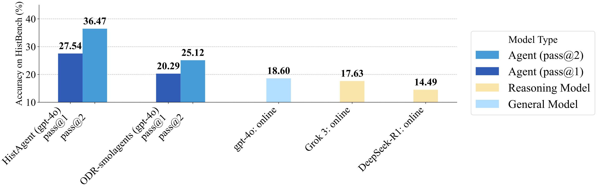
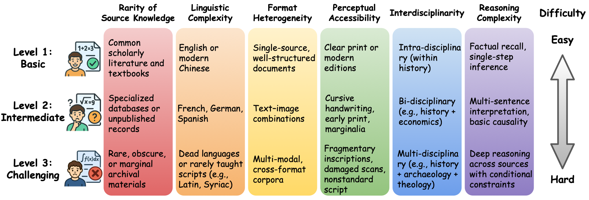
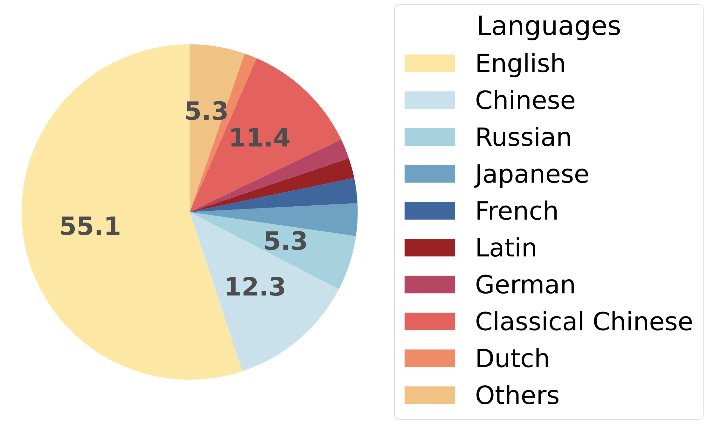
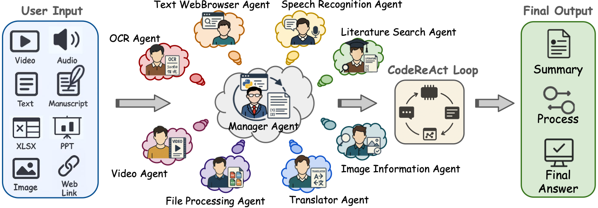
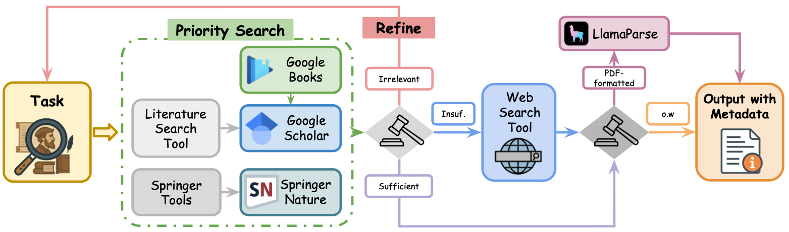

# HistAgent: Advancing Multimodal Historical Reasoning

**Official Implementation for paper: [On Path to Multimodal Historical Reasoning: HistBench and HistAgent](https://arxiv.org/abs/2505.20246)**

[](https://arxiv.org/abs/2505.20246) <!-- []() -->
[](./LICENSE) 
[](https://www.python.org/downloads/release/python-3120/)
---

Welcome to the official open-source repository for **HistAgent**, an innovative multi-agent system crafted for historical question answering. This cutting-edge tool employs advanced multimodal approaches, leveraging components such as OCR, image analysis, and file parsing to tackle the intricate challenges of historical inquiries effectively.

Reproduce our results using the resources provided in this repository, as detailed in our paper:

**"On the Path to Multimodal Historical Reasoning: HistBench and HistAgent"**<br />
*(Authors: Jiahao Qiu, Fulian Xiao, Yimin Wang, Yuchen Mao, Yijia Chen, Xinzhe Juan, Siran Wang, Xuan Qi, Tongcheng Zhang, Zixin Yao, Jiacheng Guo, Yifu Lu, Charles Argon, Jundi Cui, Daixin Chen, Junran Zhou, Shuyao Zhou, Zhanpeng Zhou, Ling Yang, Shilong Liu, Hongru Wang, Kaixuan Huang, Xun Jiang, Xi Gao, Mengdi Wang)*

HistAgent is rooted in the `smolagents` framework with adaptations for the challenges of historical reasoning. This system is rigorously evaluated on **HistBench**, a benchmark featuring 414 questions and covering 29 languages, extensively described in our paper.

## 📄 Paper and Dataset

- **Paper**: [On Path to Multimodal Historical Reasoning: HistBench and HistAgent](https://arxiv.org/abs/2505.20246)  
- **Dataset**: [HistBench on Hugging Face](https://huggingface.co/datasets/jiahaoq/HistBench)

---

## 🌟 Key Features

- **Specialized Agents**  
  Individual agents manage OCR, image analysis, document parsing (PDF, Word, Excel), translation, speech transcription, web browsing, and academic literature search.  
- **Multimodal and Multilingual Reasoning**  
  Supports diverse source materials: manuscripts, images, audio, video, inscriptions, and texts in 29 modern and ancient languages.
- **Historical OCR Integration**  
  Uses Transkribus for Western scripts and specialized models for non-Latin scripts to transcribe manuscripts and inscriptions.  
- **Citation-Aware Literature Search**  
  Prioritizes peer-reviewed sources via Google Scholar, Google Books and Springer API, returning exact quotes with full bibliographic metadata.  
- **HistBench Compatibility**: Optimized for seamless operation on HistBench, evaluating historical reasoning across various dimensions.
- **Modular and Extensible**: Built on `smolagents` for easier customization and tool extension.
- **Three-Stage Human-in-the-Loop Review Pipeline**  
  HistBench questions undergo preliminary screening, LLM-based filtering, and expert validation to ensure academic rigor and fairness in evaluation.
- **Structured Historical Evaluation Framework**  
  HistBench consists of 414 questions across 36 subfields, stratified into three difficulty levels and annotated with metadata (source, topic, reasoning dimension, and explanation).
- **Competitive and Generalizable Performance**  
  HistAgent achieves 27.54% pass@1 and 36.47% pass@2 accuracy on HistBench, outperforming GPT-4o (18.60% pass@1) and ODR-smolagents. It also maintains strong performance (60.00% pass@1) on the general-purpose GAIA benchmark.


## 📜 Abstract

Recent advances in large language models (LLMs) have driven significant progress across many fields, yet their potential in history remains little studied. Historical reasoning requires handling diverse inputs—text, images, manuscripts—and performing temporal and cross-linguistic inference. To evaluate these skills, we introduce HistBench, a collection of 414 questions spanning primary-source retrieval, interpretive analysis, and interdisciplinary challenges across 29 languages and multiple regions. Existing LLMs and generalist agents achieve low accuracy on this benchmark (e.g., GPT-4o with online search attains 18.60% pass@1), highlighting the need for tailored methods. We therefore present HistAgent, a specialized system integrating agents and tools for OCR, translation, archival search, and image understanding. HistAgent based on GPT-4o reaches 27.54% pass@1 and 36.47% pass@2 on HistBench, substantially exceeding all baselines and demonstrating that domain-focused design markedly improves historical reasoning performance. Notably, HistAgent also achieves 60.00% pass@1 accuracy on GAIA, showing that domain-specific customization doesn’t hinder HistAgent’s competitive performance on real-world general tasks.

## 📊 Performance Highlights

HistAgent demonstrates superior performance over existing LLMs on HistBench's challenging benchmarks.

<p align="center">
  
  <br>
  <em> Fig. 1: Performance comparison on HistBench.</em>
</p>

## 💡 HistBench Overview

HistBench is the first dedicated benchmark for historical reasoning in AI:

- **414 questions**, curated by domain experts and students, covering:
  - **6 reasoning dimensions**: bibliographic retrieval, source identification, source processing, historical analysis, interdisciplinary integration, cultural contextualization.
  - **3 difficulty levels**: Basic (Level 1), Intermediate (Level 2), and Challenging (Level 3).
  - **29 languages**: including English, Classical Chinese, Latin, Sanskrit, Old Uyghur, and more.
  - **Multimodal sources**: manuscripts, inscriptions, images, audio, video.
  - **36+ historical subfields**: e.g., epigraphy, climate history, intellectual history, and material culture.
- **Three-stage review**: format/semantic check → LLM-based filtering → expert validation.

<p align="center">
  
  <br>
  <em> Fig. 2: HistBench difficulty levels.</em>
</p>

<p align="center">
  
  
  <br>
  <em> Fig. 3: Language diversity (left) and geographic coverage (right) in HistBench.</em>
</p>

For details in HistBench, refer to Section 3 of our paper and Appendix A.

## 🧠 HistAgent Architecture & Specialist Agents

HistAgent utilizes a Manager Agent to coordinate specialized agents, each with targeted tools, thus embracing a modular structure for complex historical reasoning tasks.

<p align="center">
  
  <br>
  <em> Fig. 4: HistAgent architecture overview.</em>
</p>

| Agent                      | Focus                               | Core Functions                                                                                                                                   |
| -------------------------- | ----------------------------------- | ---------------------------------------------------------------------------------------------------------------------------------------- |
| **Manager Agent**          | Orchestrator                        | Directs execution, manages request parsing and validation, handles agent outputs.                                                              |
| **Text WebBrowser Agent**  | Web & Text Interaction              | Conducts web searches, navigates web content, extracts text.                                              |
| **Image Information Agent**| Image Analysis                      | Executes reverse searches, assesses image parameters, interfaces with OCR for text extraction.                                                  |
| **Literature Search Agent**| Academic Source Retrieval           | Utilizes scholarly databases for literature retrieval, processes PDFs for detailed content extraction.                                            |
| **File Processing Agent**  | Document Handling                   | Processes files like PDFs, DOCX, XLSX, etc., to extract and interpret content.                                                                    |
| **OCR Agent**              | Optical Character Recognition       | Deployed for recognizing text from images, including historical manuscripts with specialized models.                                             |
| **Speech Recognition Agent**| Audio Transcription                 | Converts speech to text, suitable for audio sources such as interviews or oral histories.                                                        |
| **Translator Agent**       | Language Conversion                 | Handles multilingual document translation, ensuring historical language accuracy.                                                               |
| **Video Agent**            | Video Analysis                      | Extracts and processes frames, enabling multimodal interrogation of video content.                                                               |
| **Baseline Agent**         | Simplified Architecture             | Provides a streamlined agent process for comparative analysis.                                                                                   |


The Manager Agent orchestrates tasks in a **CodeAct loop**, ensuring stepwise verification, citation integrity, and structured outputs.
For more detailed information on the architecture and agent functionalities, consult Section 5 of our paper.

## 🔍 Academic Literature Tools

The **Literature Search Agent** is critical in leveraging academic research capabilities within HistAgent:

<p align="center">
  
  <br>
  <em> Fig. 5: Literature Search Agent architecture.</em>
</p>

- **Smart Retrieval**: Leverages academic databases efficiently, prioritizing peer-reviewed and reputable sources.
- **Full-Text Analysis**: Engages in detailed content parsing, extracting precise quotes and sections needed for historical context.
- **Citation Aware**: Ensures integrity with metadata extraction and citation-ready outputs.
- **Integrated API Use**: Combines Springer API and browser enhancements for comprehensive sourcing.

This agent significantly enhances the integrity and depth of historical research, ensuring results are biblically verifiable.


## 🛠️ Installation

### Step 1: Clone the Repository

```bash
git clone https://github.com/CharlesQ9/HistAgent.git
cd HistAgent
```

### Step 2: Create and Activate a Conda Environment

Use Conda for efficient Python environment management.

```bash
conda create -n HistAgent python=3.12
conda activate HistAgent
```

### Step 3: Install Dependencies

Install the necessary packages via `requirements.txt` and `smolagents`.

```bash
pip install -r requirements.txt
pip install 'smolagents[dev]'
```

### Step 4: Configure Modified `browser_use` Library

HistAgent requires a modified `browser_use` library for enhanced capabilities. Ensure replacement of any existing installations with our provided version:

1. **Identify your `site-packages` directory**:

    ```bash
    python -c "import site; print(site.getsitepackages()[0])"
    ```

2. **Install the modified version of `browser_use`**: Manually replace it after identifying your environment directory.

## ⚙️ Environment Configuration

Several API keys are needed for HistAgent's operation. Configure these either via a `.env` file or set them as environment variables in your system.

### Use a `.env` File

Place a `.env` file at the project root with your keys:

```env
OPENAI_API_KEY=your_openai_api_key
SERPAPI_API_KEY=your_serpapi_api_key
IMGBB_API_KEY=your_imgbb_api_key
SPRINGER_API_KEY=your_springer_api_key
LLAMA_API_KEY=your_llama_api_key
TRANSKRIBUS_USERNAME=your_transkribus_username
TRANSKRIBUS_PASSWORD=your_transkribus_password
HF_TOKEN=your_huggingface_token
OPENROUTER_API_KEY=your_openrouter_api_key
OPENROUTER_API_BASE=https://openrouter.ai/api/v1
TEXTIN_APP_ID=your_textin_app_id
TEXTIN_SECRET_CODE=your_textin_secret_code
```

### Alternatively, Export via Terminal

Set environment variables directly:

```bash
export OPENAI_API_KEY="your_openai_api_key"
export SERPAPI_API_KEY="your_serpapi_api_key"
export IMGBB_API_KEY="your_imgbb_api_key"
export SPRINGER_API_KEY="your_springer_api_key"
export LLAMA_API_KEY="your_llama_api_key"
export TRANSKRIBUS_USERNAME="your_transkribus_username"
export TRANSKRIBUS_PASSWORD="your_transkribus_password"
```

### Command Line Overrides

For quick tests, provide API keys as command-line arguments:

```bash
python run_hist.py --run-name "test_run_cli_keys" --api-key "your_openai_key" --springer-api-key "your_springer_key" --llama-api-key "your_llama_key"
```

## 🚀 Running HistAgent (`run_hist.py`)

Use `run_hist.py` to leverage HistAgent on HistBench.

### Example Command

Run HistAgent for Level 2 questions with various capabilities enabled:

```bash
python run_hist.py --run-name "trial_level2" --use-image-agent --use-file-agent --use-literature-agent --use-browser --level level2
```

### Command Line Arguments for `run_hist.py`

| Flag                    | Description                                                                      | Default Value  |
| ----------------------- | -------------------------------------------------------------------------------- | -------------- |
| `--run-name`            | **Required.** Unique identifier for this run.                                     | `None`         |
| `--model-id`            | Specifies the language model for use (e.g., `gpt-4o`).                            | `gpt-4o`       |
| `--concurrency`         | Number of parallel tasks.                                                        | 8              |
| `--level`               | HistBench difficulty level: `level1`, `level2`, `level3`, or `all`.              | `level2`       |
| `--question-ids`        | Specific question IDs to process (comma-separated).                              | `None`         |
| `--start-id`, `--end-id`| Range of question IDs to process.                                                | `None`, `None` |
| `--results-json-path`   | Path to a previous run's `.jsonl` output for filtering or re-evaluation.        | `None`         |
| `--baseline`            | Use a simpler baseline agent architecture.                                       | `False`        |
| `--use-image-agent`     | Enables the Image Information Agent.                                             | `False`        |
| `--use-file-agent`      | Enables the File Processing Agent.                                               | `False`        |
| `--use-literature-agent`| Enables the Literature Search Agent.                                             | `False`        |
| `--use-browser`         | Enables browser-based tools (modified `browser_use` library required).           | `False`        |
| `--api-key`             | OpenAI API key (overrides other sources).                                            | `None`         |
| `--springer-api-key`    | Springer API key (overrides other sources).                                      | `None`         |
| `--llama-api-key`       | LlamaParse API key (overrides other sources).                                    | `None`         |

## 🧪 Example Commands

**1. Full Level 2 Execution:**

```bash
python run_hist.py --run-name "histagent_full_level2" --use-image-agent --use-file-agent --use-literature-agent --use-browser --level level2
```

**2. Baseline Comparison for Level 1:**

```bash
python run_hist.py --run-name "baseline_comparison_level1" --baseline --level level1
```

**3. Specific Level 3 Questions:**

```bash
python run_hist.py --run-name "selected_level3" --use-image-agent --use-file-agent --use-literature-agent --use-browser --level level3 --question-ids "5,8,20"
```

**4. Custom Dataset Processing:**

```bash
python run_hlejson.py --run-name "custom_hle_run" --use-image-agent --use-file-agent --use-literature-agent --use-browser --path-to-hle-json "path/to/custom_dataset.json"
```

*Note: Ensure `run_hlejson.py` aligns with `run_hist.py` options if based on the same architecture.*

## 📂 Output Files

Each run's results are saved in organized directories based on parameters and run names:

- **Standard runs**: `output/{LEVEL}_summary/{RUN_NAME}/`
- **Baseline runs**: `output_baseline/{LEVEL}_summary/{RUN_NAME}/`

Each directory contains:

- **JSONL**: Detailed results, agent activity, tool interactions.
- **Excel**: Summary of answers and key metrics.
- **TXT**: Human-readable answer summaries.
- **Stats JSON**: Aggregate statistics of runs (accuracy, tool use).
- **Logs Directory**:
  - **Main Log**: Run-wide logging.
  - **Task-Specific Logs**: Per question/task logging.
  - **Error Log**: Details of runtime errors encountered.

## 🧮 Evaluation

We provide an evaluation script, `judgement.py`, to assess the accuracy of HistAgent’s outputs against ground-truth answers. This script builds upon and refines the evaluation logic from the **HLE benchmark (Humanity’s Last Exam)**.

### How to Run the Evaluation

After generating result `.jsonl` files using `run_hist.py`, you can evaluate them as follows:

```bash
python judgement.py --input_file path/to/your_results.jsonl --output_file path/to/evaluated_results.jsonl
```

For batch processing multiple files, use:

```bash
python judgement.py --input_dir path/to/your_results_dir --output_dir path/to/evaluated_results_dir
```

The script uses your **OpenAI API key** for LLM-based semantic judging and allows customization of the evaluation model (e.g., `gpt-4o`).

### Evaluation Logic

- **HLE-Inspired Framework:**  
  The evaluation criteria inherit from the HLE benchmark's semantic consistency logic. It checks whether the core meaning and necessary key points in the response align with the ground truth, while allowing for small numerical errors and variations in phrasing.
- **Final Answer Extraction:**  
  The script extracts a `final_answer` from each model's response. If no exact answer is present, it records `None`.
- **Semantic Judgement:**  
  An LLM judges whether the extracted final answer matches the ground truth. If there are any inconsistencies, ambiguities, or missing key points, the answer is marked as incorrect.
- **Accuracy Calculation:**  
  The script computes overall accuracy as the proportion of correct answers. It also logs detailed information for each task, including extracted answers, reasoning, and confidence scores.

Example output for each entry:

```json
{
  "task_id": "001",
  "question": "Who painted the Mona Lisa?",
  "model_answer": "The Mona Lisa was painted by Leonardo da Vinci.",
  "true_answer": "Leonardo da Vinci",
  "is_correct": true,
  "extracted_final_answer": "Leonardo da Vinci",
  "reasoning": "The model answer directly matches the true answer without any discrepancies.",
  "confidence": 100
}
```

For detailed evaluation logic, see `judgement.py`.

## 🔗 Results Combination Tool (`combine_results.py`)

Combine and analyze results from different experiments using `combine_results.py`.

### Basic Usage

```bash
python combine_results.py output/level2_summary/run1/*.jsonl output/level2_summary/run2/*.jsonl --output-dir combined_analysis --output-name comparison_run
```

### Arguments

| Flag                  | Description                                                                                                   | Default Value                  |
| --------------------- | ------------------------------------------------------------------------------------------------------------- | ------------------------------ |
| `input_files`         | **Required.** List of `.jsonl` result files or patterns for combination.                                      | `None`                         |
| `--output-dir`        | Directory for saving combined analysis outputs.                                                               | `output/combined`              |
| `--output-name`       | Specifies a custom name for output files.                                                                     | `YYYYMMDD_HHMMSS_combined`     |
| `--conflict-strategy` | Defines the conflict resolution approach if duplicate questions are detected: `first`, `latest`, `model`.     | `latest`                       |
| `--preferred-model`   | If using `--conflict-strategy model`, specify your preferred model.                                           | `None`                         |
| `--formats`           | Desired output formats: `jsonl`, `excel`, `txt`, `all`.                                                      | `all`                          |
| `--add-readme`        | Check this to include a README that outlines combined results and settings.                                    | `False`                        |
| `--level`             | Filter combinations by task level: `level1`, `level2`, `level3`, `all`.                                      | `all`                          |
| `--copy-images`       | Shuffle and copy associated images to the output directory.                                                   | `False`                        |
| `--images-dir`        | Specify the original directory containing dataset images, necessary if `--copy-images` is active.             | `dataset/`                     |

## 📜 Citation

If you use HistAgent or HistBench, please kindly cite:

```bibtex
@misc{qiu2025pathmultimodalhistoricalreasoning,
      title={On Path to Multimodal Historical Reasoning: HistBench and HistAgent}, 
      author={Jiahao Qiu and Fulian Xiao and Yimin Wang and Yuchen Mao and Yijia Chen and Xinzhe Juan and Siran Wang and Xuan Qi and Tongcheng Zhang and Zixin Yao and Jiacheng Guo and Yifu Lu and Charles Argon and Jundi Cui and Daixin Chen and Junran Zhou and Shuyao Zhou and Zhanpeng Zhou and Ling Yang and Shilong Liu and Hongru Wang and Kaixuan Huang and Xun Jiang and Yuming Cao and Yue Chen and Yunfei Chen and Zhengyi Chen and Ruowei Dai and Mengqiu Deng and Jiye Fu and Yunting Gu and Zijie Guan and Zirui Huang and Xiaoyan Ji and Yumeng Jiang and Delong Kong and Haolong Li and Jiaqi Li and Ruipeng Li and Tianze Li and Zhuoran Li and Haixia Lian and Mengyue Lin and Xudong Liu and Jiayi Lu and Jinghan Lu and Wanyu Luo and Ziyue Luo and Zihao Pu and Zhi Qiao and Ruihuan Ren and Liang Wan and Ruixiang Wang and Tianhui Wang and Yang Wang and Zeyu Wang and Zihua Wang and Yujia Wu and Zhaoyi Wu and Hao Xin and Weiao Xing and Ruojun Xiong and Weijie Xu and Yao Shu and Xiao Yao and Xiaorui Yang and Yuchen Yang and Nan Yi and Jiadong Yu and Yangyuxuan Yu and Huiting Zeng and Danni Zhang and Yunjie Zhang and Zhaoyu Zhang and Zhiheng Zhang and Xiaofeng Zheng and Peirong Zhou and Linyan Zhong and Xiaoyin Zong and Ying Zhao and Zhenxin Chen and Lin Ding and Xiaoyu Gao and Bingbing Gong and Yichao Li and Yang Liao and Guang Ma and Tianyuan Ma and Xinrui Sun and Tianyi Wang and Han Xia and Ruobing Xian and Gen Ye and Tengfei Yu and Wentao Zhang and Yuxi Wang and Xi Gao and Mengdi Wang},
      year={2025},
      eprint={2505.20246},
      archivePrefix={arXiv},
      primaryClass={cs.AI},
      url={https://arxiv.org/abs/2505.20246}, 
}
```


## 🤝 Contributing

Contributions to HistAgent are invaluable! We're open to enhancements, fixes, or new features. Get involved by:

1. Opening an issue to discuss your ideas.
2. Forking this repository and submitting a pull request.

Refer to our [CONTRIBUTING.md](./CONTRIBUTING.md) for detailed guidelines.

*(Ensure the `CONTRIBUTING.md` file includes processes for pull requests, issue submissions, and coding standards.)*

## 📄 License

HistAgent is distributed under the [Apache-2.0](./LICENSE). See the [LICENSE](./LICENSE) file for complete info.

*(Include the full MIT License text in your repository for compliance.)*

## 🙏 Acknowledgements

Supported in part by... *(expand upon any funding and support as noted in your paper's acknowledgements)*. A special thanks to the `smolagents` developers for their foundational work, and additional gratitude to all who helped develop and refine HistBench.
